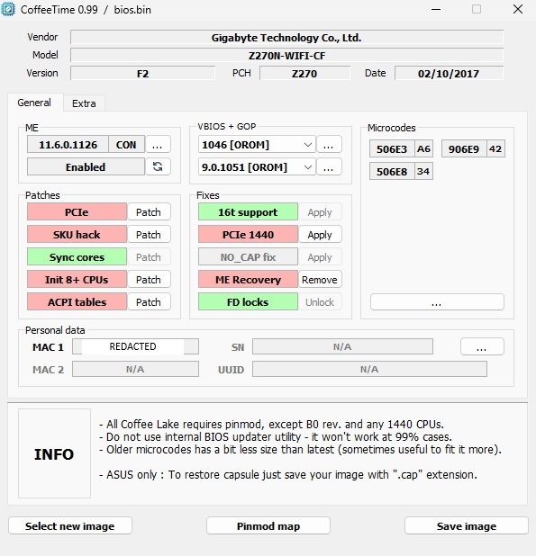

# Gigabyte Z270N-WIFI Coffee Time Mod

## Introduction
The "Coffee Time Mod" enables Gigabyte Z270N-WIFI motherboards to work with Intel 8th generation Coffee Lake processors, which are not officially supported by the motherboard manufacturers. This modification involves both BIOS modification and physical CPU pin modifications.

## Disclaimer
**Do this at your own risk.** I did not invent the Coffee Time Mod. This guide documents my personal experience with the mod. If you are planning to do the mod, I recommend that you go through other material as well (check Resources at the end). This modification could potentially damage your hardware and void warranties. **You have been warned.**

## PC Hardware
1. Motherboard: Gigabyte Z270N-WIFI
2. CPU: Intel i7 8700k

*Figure 1: BIOS chip*

*Figure 2: CPU to mod/use*

## Prerequisites
- CH341A programmer kit
- Kapton tape (heat resistant)
- Copper tape (optional, but recommended)
- Basic soldering tools (optional)
- Hacksaw (optional, for modifying the programmer clamp)

*Figure 3: CH341A programmer*

*Figure 4: CH341A programmer clamp*

## BIOS Modification Process

### 1. Install Programmer Software
- Download the CH341A programmer software and drivers (links provided in the Resources section)
- Install CH341A drivers
- Download CoffeeTime software 

(Link in the [Resources](#resources) section)

### 2. Mod Programmer
- To properly access the BIOS chip, you may need to modify the programmer clamp. 
- I had to cut a part out of the clamp. I used a hacksaw for this. 

*Figure 5: CH341A programmer clamp cut*

### 3. Connect programmer and remove the cmos
- Detach CMOS batter from the motherboard
- Attach the programmer clamp on top of the bios chip. Ensure it's aligned properly!

*Figure 6: CMOS batter detached*

*Figure 7: Programmer attached*

*Figure 8: Programmer attached 2*

### 4.Backup Original BIOS
- Launch CH341A.exe application
- Click ``Detect`` in the left corner to identify the BIOS chip
- Click ``Read`` to extract data from the chip
- Save the data as a backup file
- Click ``Verify`` to confirm the data matches the chip contents

*Figure 9: Reading*

### 5. Wipe BIOS Chip
- Click ``Erase`` to clear the chip
- Click ``Blank`` to verify the chip is empty

*Figure 10: Erasing completed*

### 6. Choose Your BIOS File

- Option 1: Use the manufacturer’s fresh BIOS (rename to .bin if needed).
- Option 2 (I used the original bios): Use your backed-up BIOS.

### 7. Modify BIOS with CoffeeTime
_Note: This process creates a new .bin file and does not overwrite your original BIOS file_
- Launch CoffeeTime software
- Select your chosen BIOS file and continue
- Select the newest Management Engine (ME) firmware - version 11.8.77.3664
- Select the latest VBIOS - version 1062
- Apply all patches and fixes
- Add the correct microcode for your CPU (check [Intel's microcode reference sheet](https://www.intel.com/content/dam/www/public/us/en/documents/corporate-information/SA00270-microcode-update-guidance.pdf))
- Save the modified image as a .bin file
- Exit the CoffeeTime

*Figure 11: CoffeeTime initial screen*

*Figure 12: Bios modification completed*

### 8. Flash the Modified BIOS
- Continue using CH341A.exe or reopen it
- Auto-detect the chip
- Open your modified BIOS .bin file
- Click ``Program`` to flash the BIOS onto the chip
- Click ``Verify`` to confirm the data was written correctly
- Exit the software
- Reattach the CMOS battery to the motherboard

## CPU Modification Process
- The Coffee Lake CPU requires specific pin modifications to work with Z270 chipsets
- Follow the pin map to determine which pins to isolate and which to connect
- Use Kapton tape (heat resistant) to isolate pins
- Use copper tape or solder to connect pins (copper tape is recommended)
- I isolated the required pins and connected the green area (shown in the pin map) by soldering for the best compatibility

*Figure 13: Pinwork map*

*Figure 14: Modded CPU*

## Verification
After modding and windows installation, you can verify the CPU is working properly with the motherboard:

- In the screenshot below, you can see the Intel i7-8700K processor running successfully on the Z270 motherboard

Figure 15: HWinfo & CPU-Z verification

## Resources 
- Drivers: [CH341A Drivers](https://github.com/vladikoms/CH341A/tree/main/CH341PAR_driver)
- Forum: [Coffee Lake BIOS Mod Tool](https://winraid.level1techs.com/t/tool-easy-automated-mod-tool-for-coffee-lake-bios/32795)
- Bios chip datasheet: [MX25L12873F Datasheet](https://media.digikey.com/pdf/Data%20Sheets/Macronix/MX25L12873F.pdf)
- Gigabyte BIOS: [Z270N-WIFI Support Page](https://www.gigabyte.com/Motherboard/GA-Z270N-WIFI-rev-10/support)
- Microcode sheet: [Intel Microcode Update Guidance](https://www.intel.com/content/dam/www/public/us/en/documents/corporate-information/SA00270-microcode-update-guidance.pdf)
- CoffeeTime tools: [CoffeeTime](https://disk.yandex.ru/d/i4FE9b-o3apk5b)
